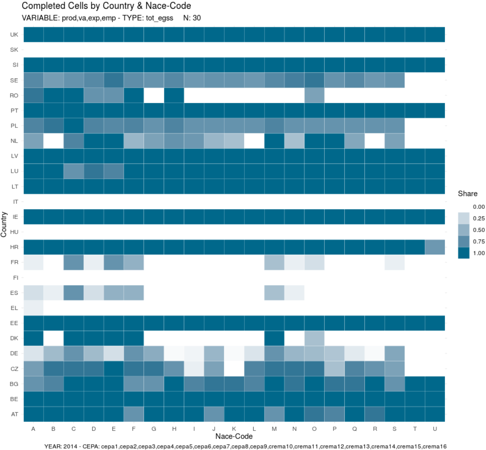
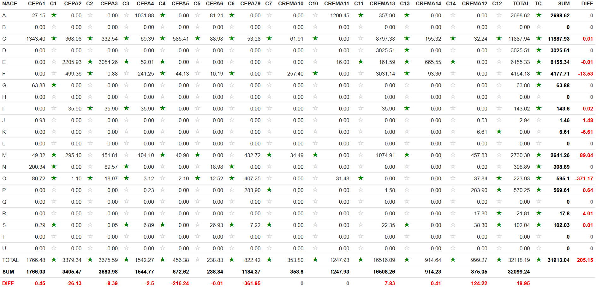
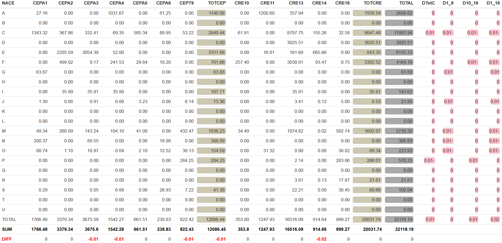
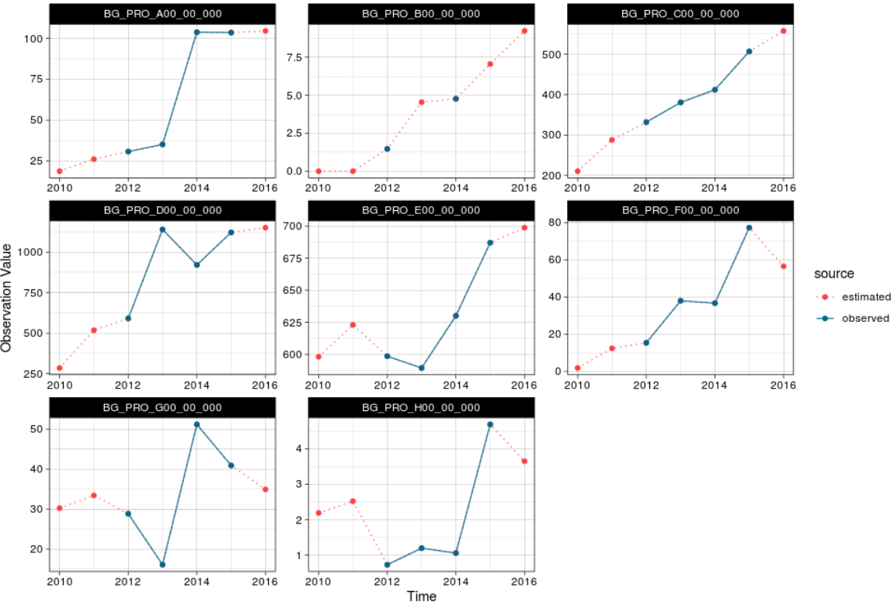
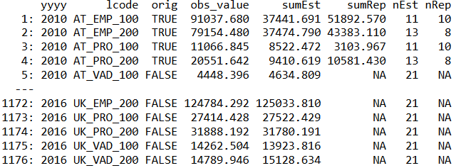

```{r, include = FALSE}
knitr::opts_chunk$set(
  collapse = TRUE,
  comment = "#>", eval = TRUE
)
```

```{r setup,echo=FALSE,include=FALSE}
library(egssGF)
```

# Introduction

The environmental goods and services sector is sometimes called ‘eco-industries’ or ‘environmental
industry’. The ‘Employment Package’ launched in April 2012 identified the “green economy” as a key source
of job creation in Europe. The EGSS domain of the European Statistical System is the ideal framework to
collect data on employment that directly depends on the production of outputs intended to protect the
environment and to manage natural resources. Due to its compatibility with the boundaries and definitions
used in the national accounts the EGSS database is an indispensable input to microeconomic and
macroeconomic analysis of the green economy, environmental and resource policy analysis and the
monitoring of policy targets. For most of the countries the EGSS is important for analysing issues related to
green growth and green employment. The main demands for EGSS data come from various Commission
Directorates General and international organisations, national governments (e.g. ministries of environment,
finance and economy), but also from business associations, workers’ unions, environmental protection
agencies, non-profit organisations and the research community.

# Data sets
The program needs three input files for each run:

1. EGSS data with periods starting in 2010 and ending at the actual end ($t$)
2. National Account data with periods from 2010 to the year which has to be predicted ($t+1$)
3. Data set with currency conversion rates for countries outside the Euro-zone


## EGSS Data

EGSS data is available in "MDT" flat format with the following file structure:

- **nace_r2**: Nace-code with 42 levels
- **ceparema**: CEPA and CReMA-codes with 29 levels: 
- **indic_pi**: Variables output, empoyees, gross value added and exports
- **ty**: Type of variable (market - non-market)
- **unit**: Full time equivalents for Employees and millions of national currency for production, value added and exports
- **geo**: Country code - 26 EU-Countries plus Swizerland and Turkey (Malta and Cyprus are missing)
- **time**: Year of observation
- **obs_value**: Observation value
- **obs_status**
- **obs_conf**
- **obs_comment**

> Data Excerpt:

```{r,echo=FALSE}
data("dat_egssBas")
dat_egssBas
```

Missing values are empty cells which are replaced by the value "NA" (not available) in R. The data-set is not complete, i.e. not all possible combinations of the classification variables are available. Moreover, the structure of the data set regarding the division of the variable type ("ty") is not consistent over time -  the structure for EGSS data before 2013 differs from the structure for years 2013 and beyond. A complete and fully consistent data set (regarding the hierarchies, not the observation values) is created with the function **loadEGSS** (see below). 

## Data from National Accounts

National accounts data is needed to calculate relative EGSS values^[relative to national accounts data] for each hierarchical level. These relative values - and not the nominal data - are used for extra- and interpolation of the data. 

Data from national accounts is structured as follows:

- **time**: Year of Observation
- **geo**: Country code (28 EU countries)
- **indic_pi**: Variables Output, Empoyees, Gross Value Added and Exports
- **nace_r2**: Nace-Code with 42 levels
- **value**: Observation Value

The level of detail is predominantly the same as for the EGSS-data set. However, nace-codes E37, E38 and E39 are only available in aggregated form. Other differences in the Nace-structure:

- Nace-code C10-C12 is not available and will be imputed as missing.
- Nace-code E is missing - sum of E36 and E37-E39 is used


## Currency conversion 

Data set containing the currency conversion rates for non-Euro zone counties^[BG, CZ, DK, UK, HR, HU, PL, RO, SE]. The conversion rates are needed for all years from 2010 to the year which has to be predicted ($t+1$). 

# Data processing
This is an explanation of all available functions provided in the **egssGF Package**. Most of these functions have to be executed in the right sequential order to perform gap filling.

## loadEGSS.R

The function **loadEGSS()** converts the EGSS-flat file to an R data-table. In a further step missing hierarchy levels are completed (with NA-values) and the consistency of the data set concerning the division of the type variable is established. The input file has to be available in "MDT"-flat format. The following steps are performed:

1. Conversion of national currency values to Euro values
2. Standardisation of "ty"-variable:
     * create structure for "ty" according to requirements 2013 (levels: MKT, C_REP and ES_CS)
     * add a Rest Category: Rest=MKT-C_REP-ES_CS
     * transform data structure for periods before 2013 to this very structure, i.e. C_REP=GDA+TCI (if both are available "old" C_REP values are deleted), Rest=GDC+TCE
3. Transfer "Basic Structure" to all Countries and Years (34.916 rows)
    *  4 variables (Production,Value Added,Employment and Exports)
    * 43 nace-codes (Nace-2digit levels, Nace-divisions and Totals)
    * 29 Ceparema codes (with aggregates)
    * 8 ty-codes and 4 ty-codes respectively (indic_pi="EXP")
4. Cells with Zeros and obs_status="L" (not applicable) are set to NA
5. Creation of a variable **"orig"** indicating if the observation value (obs_value) has been reported (orig=TRUE) or not (orig=FALSE). If obs_value was other than missing then **"orig"** was set to TRUE, i.e. all zeroes were taken as originally reported neglecting that some countries use zeros for indication of missingness.^[This makes the iterative fitting procedure challenging because original reported values are protected against adjustment and if too many values are protected the fitting procedure will not converge. To circumvent this problem the protection of zero values was released in the iterative fitting procedure]

The output of this function is an R-data-table of complete EGSS data with all combinations for 1996 to the actual year for 28 countries - 26 EU-counties plus Swizerland and Turkey (Malta and Cyprus are missing).

### Arguments of the function

+ **x**: R data-table of the EGSS base file, which has to be available in .csv format^[The .csv-File is transformed to an R data table by the command fread("xxxx.csv")]
+ **y**: R data-table with currency conversion rates for non-eurozone countries

### Output

+ Complete and consistent (with repect to the data hierarchy) R data-table of EGSS data: all combinations for 1996 to the actual year for 26 EU-countries. The original EGSS data set contains Swizerland and Turkey which were deleted here. For Malta and Cyprus, which were missing a dummy data table was created outside this function.

## loadNA.R

Extrapolation of EGSS-data was not done on nominal data but based on nominal EGSS data relative to national account data. Extrapolated ratios were then applied to available national-account data. After conversion of national currency values to Euro EGSS-ratios were calculated for each Year, Country and Variable in relation to (ranking according to availability):

1. the total of the respective detailed NACE-Code (e.g. NACE-levels C31-C33, E36,...) per EU-country and year
      + NACE-Codes E37, E38 and E39 were not available for national accounts, therefore each of these
        codes was refered to the aggregate E37-E39 which was available at national account data
2. the total of the 1-digit NACE-Section per EU-country and year if national account data was not available at the detailed NACE-Code (e.g. NACE-levels A, C,...)
3. the total of all NACE-Codes of a specific Variable per EU-country and year (Output, Value added, Employment or Exports) (e.g. total national account value for Output)
4. the total of all (available) EU-countries per Variable (Output, Value added, Employment or Exports) and Year

Caution has to be exercised to calculate all the ratios for a specific aggregate (time series) based on the same reference level.

### Coding for hierarchy levels
For easier referencing the various aggregation levels an aggregation code was created for every single aggregation level. This 17 digits-code was generated in the following manner (each element of the code is seperated by underscores)^[Codes with a star (*) were not used because of redundancies.]:

1. two digits for country code followed by underscore (e.g. AT_,BE_,...)
2. three digits for variable (e.g. EMP_, PRO_,...)
3. three digits for NACE-level A00-U00: (e.g. A00_, E00_, E36_,...)
    + first digit: character of NACE-Section
    + next two digits: number of NACE-Division, 00 is equivalent with the total NACE-Section
4. two digits for type:
    + 00_: total EGSS
    + 10_: anciliary
    + 20_: own use
    + 30_: non market
    + 40_: market
    + 41_: market ressource efficient
    + 42_: market environmental specific services
    + 43_: market rest category
5. three digits for Ceparema code 
    + 000: Total Ceparema (Total Cepa + Total CrEMa)
    + 100: Total Environmental Protection (Cepa)
    + 200: Total Ressource Management (CrEMa)
    + 110: Cepa 1
    + 120: Cepa 2
    + 130: Cepa 3
    + 140: Cepa 4
    + 150: Cepa 5
    + 160: Cepa 6
    + 170: Cepa 7*
    + 179: Cepa 7-9
    + 180: Cepa 8
    + 190: Cepa 9*
    + 201: Crema 10
    + 210: Crema 11*
    + 211: Crema 11A
    + 212: Crema 11B
    + 220: Crema 12*
    + 230: Crema 13*
    + 231: Crema 13A
    + 232: Crema 13B
    + 233: Crema 13C
    + 240: Crema 14
    + 250: Crema 15*
    + 260: Crema 16*
    + 270: Crema12_15_16


### Arguments of the function

+ **x**: National accounts data set
+ **y**: Enhanced EGSS-base data set 
+ **z**: R data table with currency conversion rates for non-eurozone countries 
+ **toEst**: Period for which flash estimates have to be generated 
+ **t1**: Type variable, for which the data matrix should be estimated (defaults to "TOT_EGSS")

### Output

Complete EGSS data-matrix enriched with national account data and respective ratios of EGSS-values to national 
account data

# Data screening

## screenData.R

The function **screenData()** offers visualisation of the completness-level of the data set.
It can be applied to the EGSS-data set at any completion level (raw data or gap-filled data). Four different plots are available,

1. country times year
2. country times Nace
3. country times Ceparema
4. Nace times Ceparema


### Arguments of the function

+ **g**: Country code
+ **per**: Period (year) 
+ **v**: Variable (one out of "PROD", "VA", "EXP" and "EMP")
+ **n2**: Nace code 
+ **cep**: Ceparema code
+ **t1**: Ty-Variable 
+ **p**: Kind of plot (see above)
+ **val**: Display parameter - Percentage of nonmissing values (val = 1) or percentage of values > 0 (val = 0)
+ **ia**: Interactive graph (TRUE, FALSE) - however, for this version no labels are available for the graph

> Example Country x Nace

```{r, echo=FALSE, out.width="100%"}

```

## tables.R

The function **tables()** produces a visualisation of the basic Nace x Ceparema Matrix with information on the reporting status of every single cell (green stars indicate original reported cells). Additionally the reported marginal distribution of the table is compared to the sum of reported values and estimated values^[if the function is applied to a gap filled version of the EGSS-data set, otherwise no estimated values are available.] in each row/column. The variable "diff" indicates wheter row and column distributions are consistent with microdata.

### Arguments of the function

+ **x**: data set to display
+ **per**: period for which the data matrix should be shown
+ **g**: country code
+ **v**: variable code

> Austrian production for 2015

```{r, echo=FALSE, out.width="100%", fig.align = "center"}

```

## tables1.R

The function **tables1()** visualizes consistency for all dimensions of the table. 

- row total with sum of ceparema 1 to 16 for each nace-section (D1_16)
- cepa totals per nace-section with sum of cepa 1 to 9 for respective nace-section (D1_9)
- crema totals per nace-section with sum of crema 10 to 16 for respective nace-section (D10_16)
- cepa totals with ceparema totals per nace-section with total (DTotC)
- column total over all nace-sections for each ceparema code including cepa 1-9, crema 10-16 and total (DIFF)


### Arguments of the function

This function has the same arguments as tables.R.

> Austrian production for 2015

```{r, echo=FALSE, out.width="100%", fig.align = "center"}

```

# Methodology

## Innovations state space models for exponential smoothing^[taken from Hyndman, R.J., & Athanasopoulos, G. (2018) Forecasting: principles and practice, 2nd edition, OTexts: Melbourne, Australia. OTexts.com/fpp2. Accessed on July 16th 2019.]
Exponential smoothing was proposed in the late 1950s^[Brown, 1959; Holt, 1957; Winters, 1960], and has motivated some of the most successful forecasting methods. Forecasts produced using exponential smoothing methods are weighted averages of past observations, with the weights decaying exponentially as the observations get older. In other words, the more recent the observation the higher the associated weight. This framework generates reliable forecasts quickly and for a wide range of time series, which is a great advantage and of major importance to applications in industry.

### Simple exponential smoothing
The simplest of the exponentially smoothing methods is naturally called simple exponential smoothing. This method is suitable for forecasting data with no clear trend or seasonal pattern.

For example, it may be sensible to attach larger weights to more recent observations than to observations from the distant past. This is exactly the concept behind simple exponential smoothing. Forecasts are calculated using weighted averages, where the weights decrease exponentially as observations come from further in the past — the smallest weights are associated with the oldest observations: 

$$y_{T+1|T}=\alpha y_T+\alpha(1-\alpha)y_{T-1}+\alpha(1-\alpha)^2 y_{T-2}+... $$
where $0≤α≤1$ is the smoothing parameter. The one-step-ahead forecast for time $T+1$ is a weighted average of all of the observations in the series $y_1,…,y_T$. The rate at which the weights decrease is controlled by the parameter $α$.

#### Component form

An alternative representation is the component form. For simple exponential smoothing, the only component included is the level, $ℓ_t$. Component form representations of exponential smoothing methods comprise a forecast equation and a smoothing equation for each of the components included in the method. The component form of simple exponential smoothing is given by: 

+ **Forecast equation** \ \ \ \ \ \ \     $y_{t+h|t}=ℓ_t$ \
+ **Smoothing equation** \ \ \ \    $ℓ_t=αy_t+(1−α)ℓ_{t−1}$, \

where $ℓ_t$ is the level (or the smoothed value) of the series at time t. Setting $h=1$ gives the fitted values, while setting $t=T$
gives the true forecasts beyond the training data.

The forecast equation shows that the forecast value at time $t+1$ is the estimated level at time $t$. The smoothing equation for the level (usually referred to as the level equation) gives the estimated level of the series at each period $t$.

### Trend methods

#### Holt's linear trend method

Holt (1957) extended simple exponential smoothing to allow the forecasting of data with a trend. This method involves a forecast equation and two smoothing equations (one for the level and one for the trend): 

+ **Forecast equation** \ \ \ \ $y_{t+h|t}=ℓ_t+hb_t$ \
+ **Level equation** \ \ \ \ \ \ \ \ \ $ℓ_t=αy_t+(1−α)(ℓ_{t−1}+b_{t−1})$ \
+ **Trend equation** \ \ \ \ \ \ \ \ \ $b_t=β∗(ℓ_t−ℓ_{t−1})+(1−β^∗)b_{t−1}$, \

where $ℓ_t$ denotes an estimate of the level of the series at time t, $b_t$ denotes an estimate of the trend (slope) of the series at time $t$, $α$ is the smoothing parameter for the level, $0≤α≤1$, and $β^∗$ is the smoothing parameter for the trend, $0≤β∗≤1$.

As with simple exponential smoothing, the level equation here shows that $ℓ_t$ is a weighted average of observation $y_t$ and the one-step-ahead training forecast for time $t$, here given by $ℓ_{t−1}+b_{t−1}$. The trend equation shows that $b_t$ is a weighted average of the estimated trend at time $t$ based on $ℓ_t−ℓ_{t−1}$ and $b_{t−1}$, the previous estimate of the trend.

The forecast function is no longer flat but trending. The h-step-ahead forecast is equal to the last estimated level plus h times the last estimated trend value. Hence the forecasts are a linear function of h. If we replace $ℓ_t$ with $y_{t+1|t}$ and $ℓ_{t−1}$ with $y_{t|t−1}$ in the smoothing equation, we will recover the weighted average form of simple exponential smoothing.

#### Damped trend methods

The forecasts generated by Holt’s linear method display a constant trend (increasing or decreasing) indefinitely into the future. Empirical evidence indicates that these methods tend to over-forecast, especially for longer forecast horizons. Motivated by this observation, Gardner & McKenzie (1985) introduced a parameter that “dampens” the trend to a flat line some time in the future. Methods that include a damped trend have proven to be very successful, and are arguably the most popular individual methods when forecasts are required automatically for many series.

In conjunction with the smoothing parameters $α$ and $β^∗$ (with values between 0 and 1 as in Holt’s method), this method also includes a damping parameter $0<ϕ<1$:

+ **Forecast equation** \ \ \ \ $y_{t+h|t}=ℓ_t+(ϕ+ϕ2+⋯+ϕh)b_t$  \
+ **Level equation** \ \ \ \ \ \ \ \ \ $ℓ_t=αy_t+(1−α)(ℓ_t−1+ϕb_{t−1})$ \
+ **Trend equation** \ \ \ \ \ \ \ \ \ $b_t=β^∗ (ℓ_t−ℓ_{t−1})+(1−β^∗)ϕb_{t−1}$ \

If $ϕ=1$, the method is identical to Holt’s linear method. For values between 0 and 1, $ϕ$ dampens the trend so that it approaches a constant some time in the future. In fact, the forecasts converge to $ℓ_T+ϕb_T/(1−ϕ)$ as $h→∞$ for any value $0<ϕ<1$. This means that short-run forecasts are trended while long-run forecasts are constant. In practice, $ϕ$ is rarely less than 0.8 as the damping has a very strong effect for smaller values. Values of $ϕ$ close to 1 will mean that a damped model is not able to be distinguished from a non-damped model. For these reasons, we usually restrict $ϕ$ to a minimum of 0.8 and a maximum of 0.98.

### Innovations state space models for exponential smoothing

The exponential smoothing methods presented above are algorithms which generate point forecasts. The statistical models here generate the same point forecasts, but can also generate prediction (or forecast) intervals. A statistical model is a stochastic (or random) data generating process that can produce an entire forecast distribution. 

Each model consists of a measurement equation that describes the observed data, and some state equations that describe how the unobserved components or states (level, trend) change over time. Hence, these are referred to as state space models.

For each method there exist two models: one with additive errors and one with multiplicative errors. The point forecasts produced by the models are identical if they use the same smoothing parameter values. They will, however, generate different prediction intervals. For further details to state space models for exponential smoothing refer to^[Hyndman, R.J., & Athanasopoulos, G. (2018)]

# Imputation

## extraPol.R

Extrapolations (forecasting and backcasting) and interpolations on each hierarchy level are done by exponential smoothing state space models (**ETS** from the forecast package).^[Hyndman et al] These models allow to include intercept terms, trend components and seasonal components. However, in our case no seasonal component was included because of the periodicity of the data (yearly). 

If only one observation is available for a specific hierarchy level or if the variance of all observations is equal to zero then this very value is extrapolated to every period needed. 


### Arguments of the function
The function has only one argument (x), which is the base level hierarchy^[Nace-codes x Ceparema codes without any aggregates, i.e. cells within the data matrix without row and column sums.] of the EGSS-data set enriched with national account data (output of function loadNA)


## gapFill.R

The imputation of missing values is done in two steps:

(1) Extrapolation and Intrapolation of Levels for which at least one observation 
   is available
(2) Mean Imputation of hierarchy-levels for which no observation is available.

The gap filling for case (1) is done with the methodology described above (Innovations state space models for exponential smoothing). All calculations are based on relative values (EGSS-data relative to data from national accounts) instead of absolute values^[This means the variation of estimated values is partly caused by the variation of national account data.]. The projected ratios are then applied to the relevant values of national accounts. Therefore a possible trend in the extrapolated data can be achieved by an extrapolated trend component in the ratios and/or by a trending behaviour of the national account data. \


The estimation of missing data for case two is also based on ratios to national account data. In this case the value of EGSS relative to national accounts is calculated for each year, country and variable. If for a certain hierarchy level no single value is available for the whole time span considered for a certain country and variable the median share of EGSS data to national accounts data for all available countries is imputed for the missing country^[Realiter, the number of nonmissing countries will differ from year to year. This will possibly effect the median value. In case no country delivered a specific hierarchy level the median is set to zero.]. This median share is then applied to the relevant national account data of the country considered. Data from national accounts must be available for every country, year and variable in order to produce a complete data matrix.

The imputation discribed in this section is done sequentially, starting 

1. on the base-level hierarchy, i.e. year x geo x nace_r2 x ceparema (omitting all row and column aggregates). 
2. On the column totals (TOTAL nace) and 
3. on the row totals (TOTAL ceparema).

For the extrapolation with time series models the procedure is staightforward. For the
imputation of median shares of national accounts the median of national accounts is 
calculated for 1. year x indic_pi x nace_r2 x ceparema, 2. year x indic_pi x ceparema and
3. year x indic_pi x nace_r2

### Arguments of the function
The function has only one argument (x) beeing the EGSS-data set enriched with national account data (output of function loadNA).

## plotData.R 

The imputation of missing data is visualised with the function **plotData()**. For each hierarchy level reported and estimated values can be compared with estimates from earlier versions of the data set. 

### Arguments of the function

+ **x**: base data set 
+ **y**: edited data set 
+ **geoC**: country code (defaults to all EU-countries)
+ **varC**: Variable indic_pi (defaults to Production)
+ **nC**: Nace code 
+ **cC**: Ceparema code 

In the plots data points from the x-data set are labled as "observed", those of the y-data set are labeled as "estimated". Therefore, if x is set to the base data set with no gap filling, original reported values can be compared with any level of imputed data (original estimates vs. all levels of iterative fitted values).

> Example Plot - originally reported data with initial gap filled data

```{r, echo=FALSE, out.width="100%", fig.align = "center"}

```

# Consistency

The estimation of missing values in the gap filling procedure is done independently on each aggregation level. Therefore the consistency of the data set is not guaranteed. In fact, most aggregates will deviate from the sum of the respective sub-aggregates. One way of establishing consistency in the data matrix is to omit all totals and instead calculate totals from the bottom level cells. This is done in the procedure **aggTotals()**. However, reported totals constitute an important information which should not be omitted. Therefore the consistency of the complete data set is established in an iterative procedure.

## iterFit.R

The function **iterFit()** establishes consistency within the gap-filled data set by iterative proportional fitting (raking). 

### Calculation of adjustment factors

In order to adjust each cell value in the Nace x Ceparema Matrix to the relevant marinal values, the subaggregates which have to sum to the aggregate are splitted into those values which have been reported by the country and values which have been estimated during the gap-filling procedure. The reason behind this splitting is, that original reported values should be kept unchanged during the adjustment algorithm. The following notation should facilitate the documentation:

+ sumEst: sum of estimated values for a specific aggregate
+ sumRep: sum of reported values for a specific aggregate (1 and 2 should sum up to the relevant aggregate value)
+ nEst: number of cells contributing to sumEst
+ nRep: number of cells contributing to sumRep
+ orig: indicator for the aggregate value - estimated or reported
+ obs_value: aggregate value (sumEst plus sumRep should sum up to obs_value)

### Conditions which have been established in order to receive consistancy:

- All zeroes of the data set were corrected to 0.0001
- The marker for all original reported zeroes in the data set was set to FALSE (i.e. these were set to not originally reported, so the propability of a change of these values was increased)

> Example

In the following table TOT_CEPA and TOT_CREMA for each Nace-Level are summed to fit the relevant total of TOT_CEPA and TOT_CREMA. In the first row the value for TOT_CEPA (lcode=xx_xxx_100, lcode=xx_xxx_200 for TOT_CREMA) for employment in Austria in the year 2010 for all Nace-codes was 91037.680. This value was originally reported by the country (orig=TRUE). From the 21 sub-aggregates 11 have been estimated (nEst=11) and for 10 Nace-codes the value for TOT_CEPA has been reported by the country. If the 11 estimated values and the 10 reported values are summed up the respective results are 37441.691 and 51892.570. The sum of these two values is 89334.26 which is slightly lower than the reported aggregat. Therefore the estimated values have to be upweighted. The original reported values stay unchanged as long as sumEst <= obs_value.

```{r, echo=FALSE, out.width="100%", fig.align = "center"}

```

### Current R-Code for adjustment within the function

`testAll[orig==FALSE & obs_value<sumRep, ":=" (obs_value = sumRep, korrObsV = 1)]`
`testAll[orig==FALSE & !is.na(sumEst) & !(sumEst>0) & sumRep>0, ":=" (obs_value = sumRep, korrObsV = 1)]`
`testAll[orig==TRUE & obs_value < 0.0002 & sumRep>0, ":=" (obs_value = sumRep, korrObsV = 1)]`

`testAll[is.na(sumEst) & is.na(sumRep),  ":=" (factorEst = 0, factorRep = 0)]`
`testAll[is.na(sumEst) & sumRep < 0,     ":=" (factorEst = 0, factorRep = 1)]` 
`testAll[is.na(sumEst) & sumRep == 0,    ":=" (factorEst = 0, factorRep = 1)]`
`testAll[is.na(sumEst) & sumRep > 0,     ":=" (factorEst = 0, factorRep = 1)]`
`testAll[is.na(sumEst) & sumRep > 0 & orig==TRUE & obs_value > 0,`
`                                         ":=" (factorEst = 0, factorRep = obs_value/sumRep)]`

`testAll[sumEst == 0 & is.na(sumRep),    ":=" (factorEst = 1, factorRep = 0)]`
`testAll[sumEst == 0 & sumRep < 0,       ":=" (factorEst = 1, factorRep = 0)]`
`testAll[sumEst == 0 & sumRep == 0,      ":=" (factorEst = 1, factorRep = 1)]`
`testAll[sumEst == 0 & sumRep > 0,       ":=" (factorEst = 1, factorRep = 1)]`
`testAll[sumEst == 0 & sumRep > 0 & orig == TRUE & obs_value > 0,`
`                                          ":=" (factorEst = 1, factorRep = obs_value/sumRep)]`

`testAll[!(sumEst == 0) & sumRep < 0,    ":=" (factorEst = (obs_value-sumRep)/sumEst, factorRep = 1)]`
`testAll[!(sumEst == 0) & sumRep == 0,   ":=" (factorEst = obs_value/sumEst, factorRep = 1)]`
`testAll[!(sumEst == 0) & is.na(sumRep), ":=" (factorEst = obs_value/sumEst, factorRep = 0)]`
`testAll[!(sumEst == 0) & sumRep > 0 & obs_value > 0 & obs_value >= sumRep,`
`                                          ":=" (factorEst = (obs_value-sumRep)/sumEst, factorRep = 1)]`

`testAll[!(sumEst == 0) & sumRep > 0 & obs_value > 0 & obs_value < sumRep & orig == TRUE,`
`                                          ":=" (factorEst = 0, factorRep = obs_value/sumRep)]`  

`testAll[!(sumEst == 0) & sumRep > 0 & obs_value > 0 & obs_value < sumRep & orig == FALSE,`
`                                          ":=" (factorEst = 1, factorRep = 1, obs_value = sum(sumRep, sumEst),`
`                                                korrObsV = 1)]`
`  testAll[sumEst > 0 & sumRep > 0 & obs_value == 0,`
`                                          ":=" (factorEst = 1, factorRep = 1, obs_value = sum(sumRep, sumEst),`
`                                                korrObsV = 1)]`
`  testAll[sumEst < 0 & sumRep > 0 & obs_value == 0,`
`                                          ":=" (factorEst = 0, factorRep = 1)]`  

### Arguments of the function

The function **iterFit()** hast the following arguments:

- **x**: data set to be made consistent 
- **z**: argument for merging the sub-aggregate to the aggregate 
- **lc**: code of hierarchy level to merge sub-aggregate values to relevent aggregate 
- **nLevel**: Nace-level of the aggregate 
- **nLevel1**: Nace-level of the sub-aggregate 
- **cLevel**: Ceparema-level of the aggregate 
- **cLevel1**: Ceparema-level of the sub-aggregate 
- **mod**: protection level of original reported values 

## genConv.R

In order to generate a convergent data matrix the iterative fitting has to be executed in a specific order. The following eight iteration steps have to be processed (all per year, country and variable):

1. fitting row totals (21 nace-totals) to egss-total 
2. fitting TOT_CEPA and TOT_CREMA to egss-total
3. fitting column totals (total over all nace-sections) of CEPA1-9 to column total of TOT_CEPA
4. fitting column totals (total over all nace-sections) of CREAM10-16 to column total of TOT_CREMA
5. fitting TOT_CEPA plus TOT_CREMA of each individual Nace-section to row total (nace-total) 
6. fitting sum of CEPA1-9 of each Nace-section to TOT_CEPA of respective Nace-section
7. fitting sum of CREMA10-16 of each Nace-section to TOT_CREMA of respective Nace-section
8. fitting column totals (total over all nace-sections) of CEPA1-9, TOT_CEPA, CREMA1-16 and TOT_CREMA to respective column totals

These iteration steps are performed in the function genConv. 

### Arguments of the function

The function has two arguments, the data set which should be made consistent and the number of iterations to perform. 

## iterControl.R

Function to check, if the iterative fitting was successful. All eight dimensions which are fitted are controlled. For each dimension the share of deviations > 0.5 and > 0.02 (in absolute value) are caluculated and the aggregation level with the highest absolute deviation is delivered.

### Arguments of the function
The argument (x) of this function is the data set which consistency has to be checked

# Results

## aggTotals.R

After gap-filling the resulting data-matrix lacks consistency. Reported and estimated totals do not fit the individual sub-aggregate values. In the function *aggTotals* all marginal distributions (reported or estimated) are removed from the matrix and are just recalculated from the bottom level cells. In this way a consistent data matrix is produced. The steps in the preceding section (Consistency) are not necessary and therefore omitted.

### Arguments of the function

The function has one argument (x) which is the gap-filled data matrix (output of *gapFill*).

## results.R

Thi function  **results()** generates the final output table. The format is oriented on the input flat file. The function creates a list with 3 list-elements:

1. EGSS-data table for all countries, years and variables
2. EGSS-data table for EU28 (all years and variables)
3. EGSS-data table for EU27 (all years and variables)
